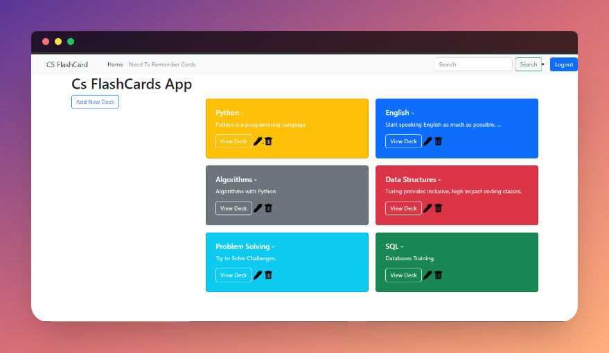
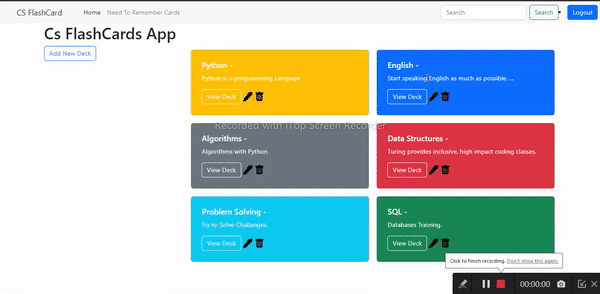
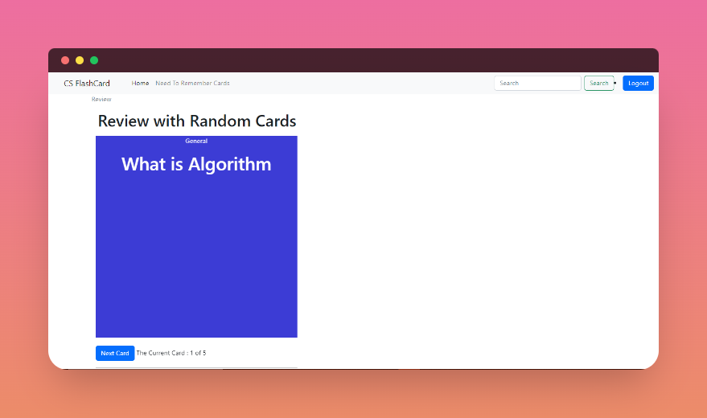
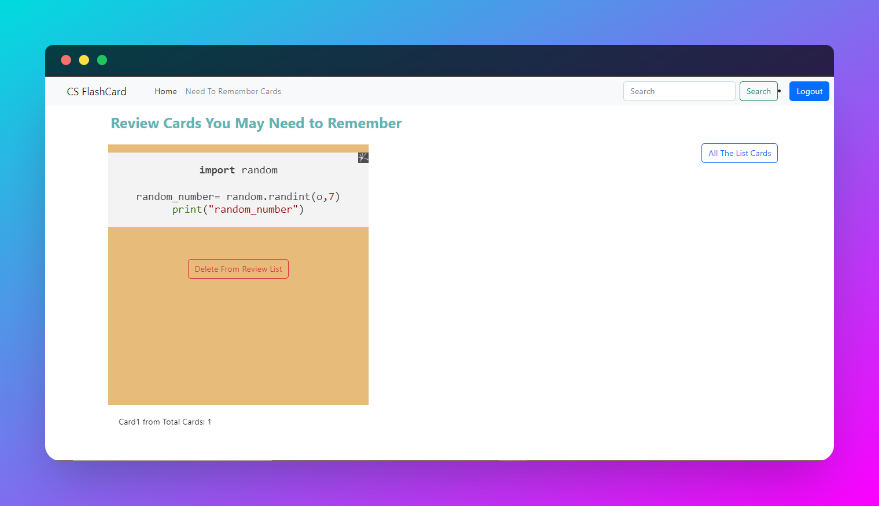
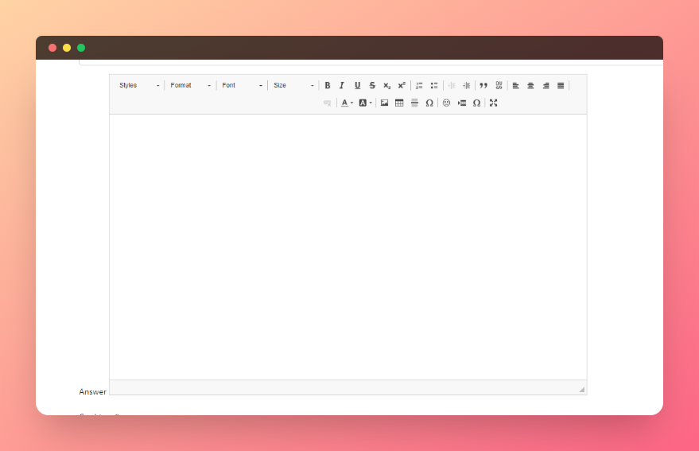

<h2>Flash Card App With Django and some Css</h2>
<h3>Create Deck And Customize it </h3>

<h3>Inside The Deck You Can Create Fliping Cards with Front Card (Question) and Back Card (Answer) </h3>

 Inside Each Card you can Update or Delete The Card and also you can view The whole Card Details Page 

<h3>Review Cards </h3>

<h3>Add Cards That you might Need to Review Later in Need to Remember Card List </h3>

<h3>Create Card Deatails With Rich Text editor which enables to add images and resize it ,code snippets,style the content and more other advanced things. </h3>

